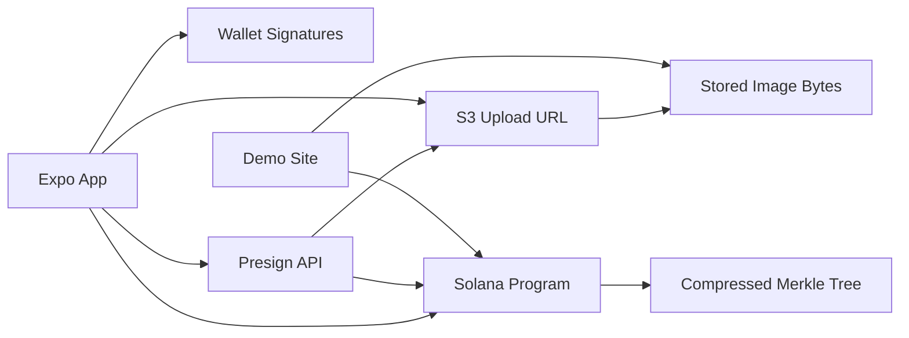
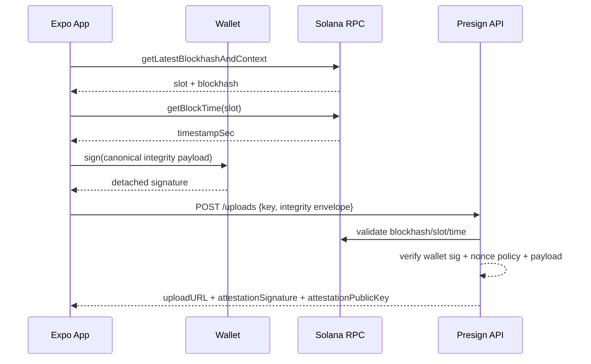
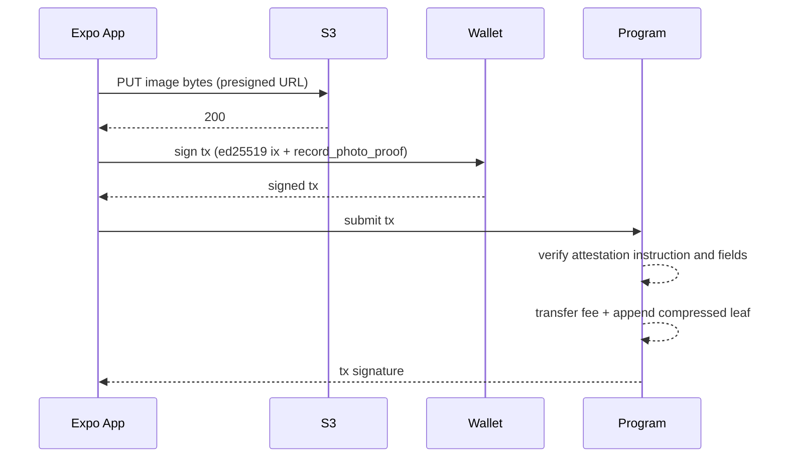

# Architecture and Data Flow

## Goal

Produce a verifiable proof that a submitted photo corresponds to:

- device-captured bytes hashed locally
- wallet-signed integrity payload
- chain-anchored timestamp/block reference
- privacy-preserving H3 location cell
- server attestation verified on-chain

## High-Level System

## Components

- `photo-verifier` app:
  - captures image
  - computes BLAKE3 hash locally
  - derives H3 cell via SDK (`h3-reactnative` backend)
  - gets chain anchor (`slot`, `blockhash`, `block time`)
  - signs canonical integrity payload
  - uploads image and submits transaction
- `@endcorp/photoverifier-sdk`:
  - hash/storage/location helpers
  - H3 helpers (`locationToH3Cell`, `h3CellToU64`)
  - presign parser + canonicalization
  - transaction builders for `photo-proof-compressed`
- Presign API (Lambda/API Gateway):
  - verifies wallet signature over canonical payload
  - validates chain anchor freshness
  - signs attestation message with server key
  - returns presigned S3 PUT URL + attestation signature
- S3:
  - stores image objects (not on-chain)
  - key pattern: `photos/<seekerMint>/<hash>.jpg`
- `photo-proof-compressed` program:
  - verifies ed25519 pre-instruction by attestation authority
  - verifies message fields (owner/hash/nonce/timestamp/h3)
  - charges fee and appends compressed leaf
- `demo-site`:
  - lists S3 objects
  - correlates with on-chain records via Helius/RPC tx scans
  - displays verification summary

## Trust Boundaries

- Client payload is untrusted by default.
- Presign API validates wallet signature and anchor constraints before upload authorization.
- On-chain program trusts only signatures from configured attestation authority.
- S3 is storage only; authenticity depends on signed payload + on-chain append.

## Integrity Payload (v1)

Canonical fields:

- `hashHex`
- `h3Cell`
- `h3Resolution`
- `timestampSec`
- `wallet`
- `nonce`
- `slot`
- `blockhash`

Canonicalization is strict JSON key order (SDK helper).

## On-chain Record Fields

`record_photo_proof` args:

- `hash: [u8; 32]`
- `nonce: u64`
- `timestamp: i64`
- `h3_index: u64`
- `attestation_signature: [u8; 64]`

Attestation message prefix: `photo-proof-attestation-v1`.

## Sequence: Capture to Upload Authorization

## Sequence: Upload to On-chain Append

## Cluster Model

Current demo behavior supports split-cluster concerns:

- Seeker verification RPC can be mainnet (`EXPO_PUBLIC_SEEKER_VERIFICATION_RPC_URL`)
- Photo proof write flow uses selected app cluster/RPC

This allows mainnet asset verification while writing proofs to devnet during development.

## Rotation Checklist

When changing program ID or authorities, update all call sites in same change:

- on-chain constants
- SDK constants
- infra template + deploy script defaults
- app/demo env defaults
- docs baseline values
