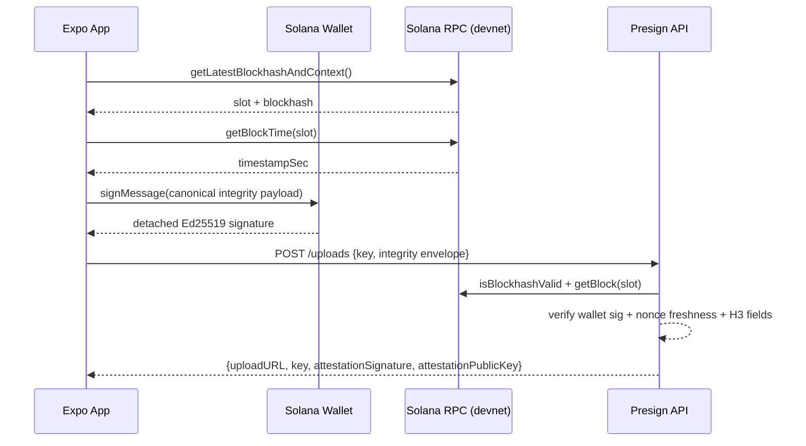
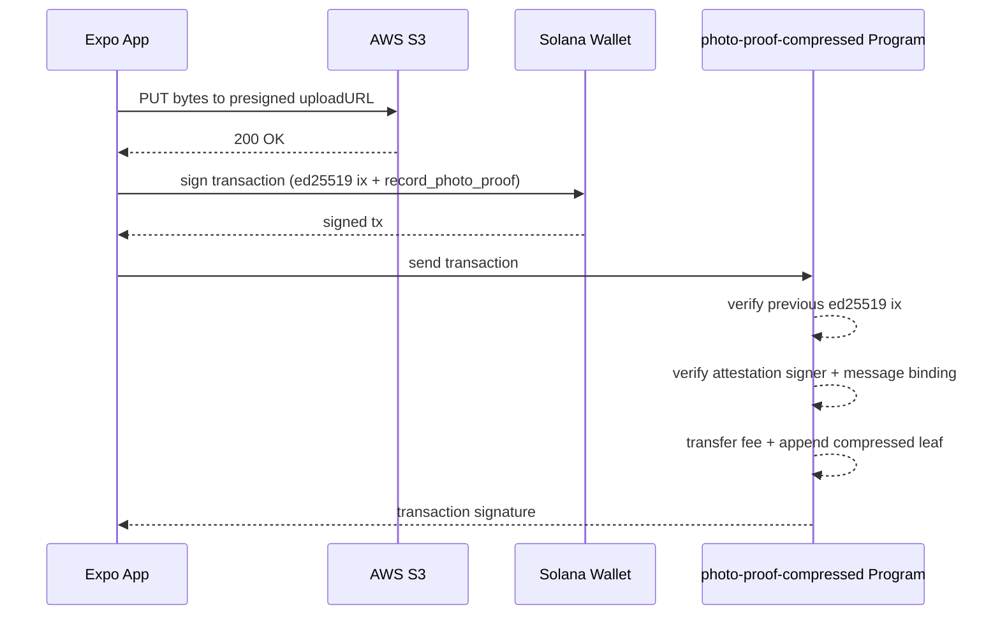
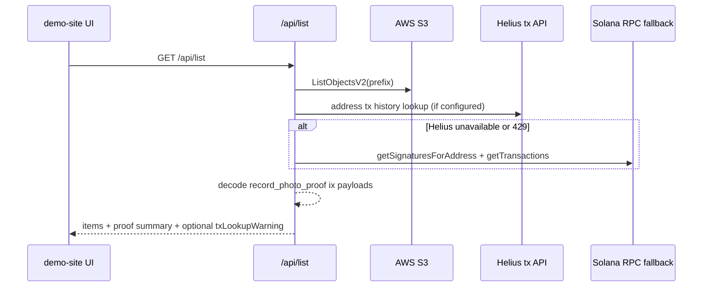

# Architecture and Data Flow

## Purpose

The system proves that a photo hash was submitted by a wallet holder, tied to a verified chain timestamp/H3 payload, and appended on Solana via compressed accounts.

## Components

- `photo-verifier` (Expo app): captures image bytes, derives H3 cell from device location, anchors to chain time, signs payload, and submits flow.
- `@photoverifier/sdk`: hash/storage helpers, seeker checks, transaction builders, presign response parser.
- `presign API` (AWS Lambda + API Gateway): verifies integrity envelope, validates chain anchor freshness, signs attestation, returns presigned S3 PUT URL.
- `S3` bucket: stores uploaded image bytes by deterministic key (`photos/<seekerMint>/<hash>.jpg`).
- `photo-proof-compressed` program (Anchor): verifies server attestation and appends leaf to compressed Merkle tree.
- `demo-site` (Next.js): lists S3 images and correlates with on-chain records from tx index lookups.

## Trust Boundaries

- Client inputs are untrusted by default.
- Presign API verifies wallet signature and chain anchor before granting upload.
- On-chain program trusts only attestations signed by `ATTESTATION_AUTHORITY`.
- S3 object storage is treated as blob storage; authenticity is anchored by hash + on-chain append.

## Key Identifiers

| Name | Value | Source of truth |
|---|---|---|
| Program ID | `3i6eNpCFvXhMg8LESAutXWKUtAey9mAbTziLLuUc78Hu` | `on-chain/.../src/lib.rs`, `packages/.../onchain.ts` |
| Program upgrade authority | `8gXhVFRwWuJZzB6LPD1QRvvqJoy4hPv16PqknJdKapQn` | `solana program show` |
| Fee authority (record fee recipient) | `DTrsex7XGyS6QstUr4GFZ4cHYEm4YoeD75799A7ns7Sc` | `on-chain/.../src/lib.rs`, SDK constant |
| Attestation authority (public) | `Ga6SxqKLPTzrc4pykqrawSi9pvz3ZGhAdnZSBDKKioYk` | `on-chain/.../src/lib.rs`, SDK + infra defaults |

## Flow 1: Capture and Presign Authorization

## Flow 2: Upload and On-chain Append

## Flow 3: Demo-Site List and Verification Summary

## On-chain Record Payload (high level)

`record_photo_proof` binds:

- `hash[32]`
- `nonce(u64)`
- `timestamp(i64)`
- `h3_index(u64)`
- `attestation_signature[64]`

Program verifies an `ed25519` instruction immediately before program instruction, requiring:

- signer pubkey == attestation authority
- signature bytes == args.attestation signature
- signed message prefix == `photo-proof-attestation-v1`
- message fields match owner/hash/nonce/timestamp/h3_index

## Rotation Notes

When rotating program ID or authorities, update all callsites in the same change:

- On-chain constants (`PROGRAM_FEE_AUTHORITY`, `ATTESTATION_AUTHORITY`)
- SDK constants (`PHOTO_PROOF_COMPRESSED_PROGRAM_ID`, fee/attestation constants)
- Infra defaults (`AttestationPublicKey` in CloudFormation and deploy script)
- App/demo defaults and docs

Do not commit private keys. Private attestation key is deploy-time secret only.
